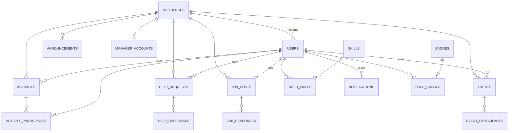
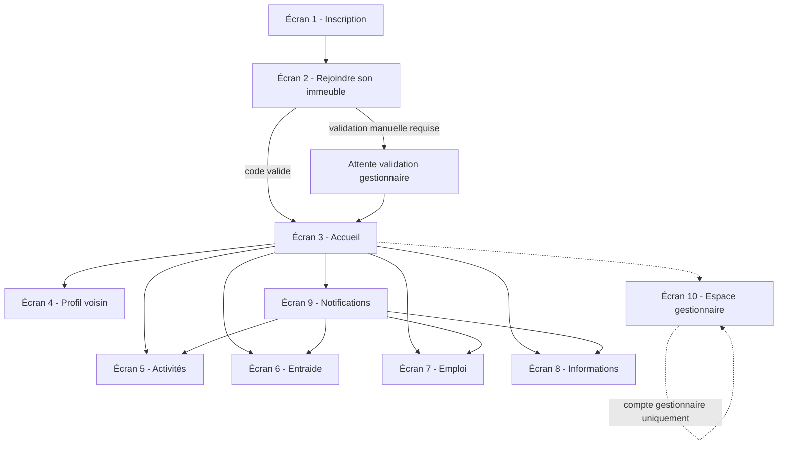

# Cahier des charges — MVP "Application Voisinage"

> Le réseau privé de votre résidence.

Ce document décrit le MVP écran par écran : objectifs, composants/boutons, données
stockées, requêtes/API, règles métier et parcours utilisateur. Il sert de base
pour un développement en interne ou par un prestataire (Flutter / React Native
+ Supabase/PostgreSQL).

## Sommaire

- [0. Positionnement](#0-positionnement)
- [1. Architecture technique](#1-architecture-technique)
- [2. Modèle de données — vue d'ensemble](#2-modèle-de-données--vue-densemble)
- [3. Écrans](#3-écrans)
  - [Écran 1 — Inscription](#écran-1--inscription)
  - [Écran 2 — Rejoindre son immeuble](#écran-2--rejoindre-son-immeuble)
  - [Écran 3 — Accueil](#écran-3--accueil)
  - [Écran 4 — Profil voisin](#écran-4--profil-voisin)
  - [Écran 5 — Activités](#écran-5--activités)
  - [Écran 6 — Entraide](#écran-6--entraide)
  - [Écran 7 — Emploi / réseau professionnel](#écran-7--emploi--réseau-professionnel)
  - [Écran 8 — Informations de résidence](#écran-8--informations-de-résidence)
  - [Écran 9 — Notifications](#écran-9--notifications)
  - [Écran 10 — Espace gestionnaire](#écran-10--espace-gestionnaire)
- [4. Parcours utilisateur global](#4-parcours-utilisateur-global)
- [5. Modèle de monétisation](#5-modèle-de-monétisation)
- [6. Sécurité, vérification & RGPD](#6-sécurité-vérification--rgpd)
- [7. Roadmap de lancement (immeuble pilote)](#7-roadmap-de-lancement-immeuble-pilote)
- [8. KPIs à suivre](#8-kpis-à-suivre)

---

## 0. Positionnement

L'application connecte les habitants d'un même immeuble/résidence autour de 7
usages : rencontre des voisins, activités sportives/loisirs, entraide,
réseau professionnel, informations officielles de la résidence, dons/prêts
d'objets, événements.

Différenciant vs WhatsApp : tout est structuré par résidence et par usage
(sections dédiées, formulaires, filtres), pas un flux de discussion unique.

---

## 1. Architecture technique

| Brique | Choix |
|---|---|
| Application mobile | Flutter (ou React Native) — cible iOS + Android |
| Backend | Supabase (Auth, Postgres, Realtime, Storage, Edge Functions) |
| Base de données | PostgreSQL (via Supabase), sécurisée par Row Level Security (RLS) |
| Authentification | Email + téléphone (OTP), option Sign in with Apple / Google |
| Notifications push | Firebase Cloud Messaging (FCM) |
| Stockage fichiers | Supabase Storage (photos de profil, pièces jointes, documents résidence) |
| Paiement (offre gestionnaire) | Stripe (abonnement mensuel par résidence) |

**Principe clé de sécurité multi-résidence** : chaque table métier porte une
colonne `residence_id`. Les policies RLS garantissent qu'un utilisateur ne
peut lire/écrire que les données de **sa propre résidence**. Voir
`database-schema.sql`.

---

## 2. Modèle de données — vue d'ensemble



Détail complet des tables, colonnes, contraintes et policies RLS :
voir [`database-schema.sql`](./database-schema.sql).

---

## 3. Écrans

### Écran 1 — Inscription

**Objectif** : créer un compte utilisateur.

**Wireframe (texte)**
```
┌─────────────────────────────┐
│      Bienvenue 👋           │
│                              │
│  Prénom        [________]   │
│  Nom           [________]   │
│  Email         [________]   │
│  Téléphone     [________]   │
│  Mot de passe  [________]   │
│                              │
│  [ ] J'accepte les CGU/RGPD │
│                              │
│   [   S'inscrire   ]        │
│   [ Continuer avec Apple ]  │
│   [ Continuer avec Google ] │
│                              │
│  Déjà un compte ? Se connecter │
└─────────────────────────────┘
```

**Boutons / actions**
- `S'inscrire` → crée le compte (Supabase Auth), envoie un email/SMS de
  vérification.
- `Continuer avec Apple / Google` → OAuth, pré-remplit nom/prénom/email.
- `Se connecter` → bascule vers l'écran de connexion (email + mot de passe
  ou OTP).

**Données stockées**
- `auth.users` (Supabase Auth, géré nativement : email, téléphone, hash mdp).
- `public.users` : `id`, `auth_id`, `first_name`, `last_name`, `email`,
  `phone`, `terms_accepted_at`, `created_at`. `residence_id` reste `NULL`
  tant que l'écran 2 n'est pas complété.

**Règles métier**
- Email et téléphone uniques.
- Compte créé mais **non actif** (pas d'accès au reste de l'app) tant que
  l'utilisateur n'a pas rejoint une résidence (écran 2).
- Vérification email/SMS obligatoire avant de continuer.

---

### Écran 2 — Rejoindre son immeuble

**Objectif** : rattacher l'utilisateur à une résidence, avec vérification
qu'il y habite réellement.

**Wireframe**
```
┌─────────────────────────────┐
│   Rejoindre ma résidence     │
│                              │
│  Code résidence              │
│  [ LES-OLIVIERS-482      ]   │
│                              │
│  N° appartement (optionnel)  │
│  [________]                  │
│                              │
│   [   Rejoindre   ]          │
│                              │
│  Je n'ai pas de code →       │
│  Contacter mon gestionnaire  │
└─────────────────────────────┘
```

**Boutons / actions**
- `Rejoindre` → vérifie que `residences.code` existe, crée le lien
  `users.residence_id`, statut `pending` ou `active` selon config (le
  gestionnaire peut exiger une validation manuelle).
- `Je n'ai pas de code` → affiche un flux de contact/support (email
  gestionnaire, formulaire "demander l'accès").

**Données stockées**
- `residences` : `id`, `name`, `code` (unique, ex. `LES-OLIVIERS-482`),
  `address`, `postal_code`, `manager_id`, `created_at`.
- `users.residence_id`, `users.apartment_number`, `users.residence_status`
  (`pending` / `active` / `rejected`).

**Règles métier**
- **Option A (MVP) — Code de résidence** : le gestionnaire (ou le premier
  utilisateur "fondateur" en mode auto-organisé) génère un code unique par
  résidence, à distribuer physiquement (affichage hall, boîtes aux lettres).
- Un utilisateur ne peut appartenir qu'à **une seule résidence active** à la
  fois (v1).
- Si validation manuelle activée : l'utilisateur reste en `pending`, ne voit
  qu'un écran d'attente, et une notification part vers le gestionnaire.

---

### Écran 3 — Accueil

**Objectif** : point d'entrée quotidien, résumé de l'activité de la
résidence (moteur de rétention).

**Wireframe** *(reprend la maquette fournie)*
```
Bonjour Mohammed 👋
🏠 Résidence Les Oliviers

┌───────────────────────┐
│ 📢 2 informations      │
│ importantes            │
└───────────────────────┘

⚽ Activités        3 disponibles →
🤝 Entraide          5 demandes →
💼 Opportunités      2 nouvelles →
🎉 Événements        1 ce week-end →
```

**Boutons / actions**
- Chaque carte est cliquable → navigue vers l'écran correspondant
  (Informations, Activités, Entraide, Emploi, Événements).
- Icône cloche (haut) → Écran 9 Notifications.
- Icône profil (haut) → Écran 4 Profil (le sien).

**Données affichées (lecture agrégée, pas de table dédiée)**
- Compteurs calculés à la volée (ou via vue SQL / Edge Function cache) :
  `announcements` non lues, `activities` à venir, `help_requests` ouvertes,
  `job_posts` récents (< 7 jours), `events` à venir.

**Règles métier**
- Les compteurs sont scoping `residence_id = user.residence_id`.
- Badge rouge sur la cloche si notifications non lues.
- Objectif produit : donner **une raison concrète de revenir** (voir §9 de
  l'idée initiale — lutte contre l'inactivité).

---

### Écran 4 — Profil voisin

**Objectif** : se présenter, indiquer ses compétences/disponibilités
d'entraide, permettre le contact.

**Wireframe**
```
┌─────────────────────────────┐
│   [Photo]  Mohammed          │
│   📍 Résidence Les Oliviers  │
│   💼 Data Analyst             │
│   ⚽ Football / Padel         │
│   🇫🇷 Français · 🇬🇧 Anglais  │
│                              │
│   🤝 Peut aider avec :        │
│   💻 Informatique  📊 Finance │
│                              │
│   [   Contacter   ]          │
└─────────────────────────────┘
```

**Boutons / actions**
- `Contacter` → ouvre une conversation privée (messagerie interne) ou
  déclenche une demande de mise en relation (le numéro de téléphone n'est
  **jamais** affiché directement en v1, pour la confidentialité).
- Sur son propre profil : bouton `Modifier mon profil`.
- `Signaler` (menu ⋮) → écran de signalement (modération, voir §6).

**Données stockées**
- `users` (complément) : `avatar_url`, `job_title`, `bio`,
  `languages text[]`, `sports text[]`.
- `user_skills` (n-n avec `skills`) : compétences "je peux aider avec"
  (💻 Informatique, 📚 Études, 🔧 Bricolage, 🚗 Voiture, 👶 Enfants,
  🐶 Animaux, 🍳 Cuisine, 🇬🇧 Anglais, 📊 Finance, 📸 Photo, ⚽ Sport).
- `user_badges` : badges gagnés (voir §10 idée initiale : Voisin actif,
  Aide régulièrement, Organisateur, Bricoleur, Mentor…).
- `conversations` / `messages` : messagerie 1-to-1 déclenchée par
  "Contacter".

**Règles métier**
- Numéro d'appartement visible seulement par le gestionnaire (pas par les
  autres voisins), sauf choix explicite de l'utilisateur.
- Recherche transversale "Qui peut m'aider avec Excel ?" → requête sur
  `user_skills` filtrée par `residence_id` (effet réseau clé du produit).

---

### Écran 5 — Activités

**Objectif** : organiser/rejoindre des séances sportives ou loisirs.

**Wireframe**
```
┌─────────────────────────────┐
│  ⚽ Activités        [ + ]   │
│  Filtres: Tous ▾ Foot Padel  │
│                              │
│  ⚽ Foot — dimanche 10h       │
│  📍 Stade municipal           │
│  👥 6/10 participants         │
│        [ Je participe ]      │
│                              │
│  🎾 Padel — samedi 18h        │
│  👥 3/4 participants          │
│        [ Je participe ]      │
└─────────────────────────────┘
```

**Boutons / actions**
- `+` (créer) → formulaire : type de sport (Foot, Padel, Tennis, Running,
  Pétanque, Randonnée, Salle de sport, Jeux de société, Autre), date/heure,
  lieu, nombre max de participants, description optionnelle.
- `Je participe` / `Se désinscrire` → toggle inscription.
- Filtre par type de sport.
- Sur une activité pleine : bouton devient `Complet` (désactivé) ou
  `Liste d'attente`.

**Données stockées**
- `activities` : `id`, `residence_id`, `creator_id`, `sport_type`,
  `title`, `description`, `location`, `starts_at`, `max_participants`,
  `status` (`open`/`cancelled`/`past`), `created_at`.
- `activity_participants` : `activity_id`, `user_id`, `status`
  (`confirmed`/`waitlist`), `joined_at`.

**Règles métier**
- Une activité passe automatiquement en `past` après `starts_at`.
- Notification push aux participants si l'organisateur annule ou modifie
  l'horaire/lieu.
- Notification "il reste 1 place" quand `participants = max - 1`.

---

### Écran 6 — Entraide

**Objectif** : demander ou proposer un coup de main entre voisins.

**Wireframe**
```
┌─────────────────────────────┐
│  🤝 Entraide         [ + ]   │
│                              │
│  📦 Besoin d'un coup de main  │
│  Récupérer mon colis demain   │
│  Demain — 18h                │
│        [ Je peux aider ]     │
│                              │
│  🔧 Quelqu'un connaît un bon  │
│  plombier ?                  │
│        [ Répondre ]          │
└─────────────────────────────┘
```

**Boutons / actions**
- `+` (créer une demande) → catégorie (📦 Service ponctuel, 🔧 Bon plan/
  recommandation, 🐶 Garde d'animaux/enfants, 🛠️ Bricolage, Autre),
  titre, description, date/heure souhaitée si pertinent.
- `Je peux aider` / `Répondre` → ouvre une réponse (message ou proposition
  de créneau), notifie le créateur.
- `Marquer comme résolu` (visible par le créateur) → clôture la demande.

**Données stockées**
- `help_requests` : `id`, `residence_id`, `creator_id`, `category`,
  `title`, `description`, `needed_at`, `status`
  (`open`/`in_progress`/`resolved`), `created_at`.
- `help_responses` : `id`, `help_request_id`, `user_id`, `message`,
  `created_at`.

**Règles métier**
- Une demande `resolved` reste visible 7 jours puis s'archive (historique
  de confiance/réputation).
- Chaque réponse déclenche une notification au créateur (Écran 9).
- Possibilité de "proposer" plutôt que "demander" (ex. "Je prête ma
  perceuse") — même table, `type = demande | proposition`.

---

### Écran 7 — Emploi / réseau professionnel

**Objectif** : mise en relation professionnelle entre voisins (avantage
compétitif clé vs WhatsApp).

**Wireframe**
```
┌─────────────────────────────┐
│  💼 Opportunités              │
│  [ 🟢 Je propose ] [ 🔵 Je recherche ] │
│                              │
│  💼 Recherche stage Data Analyst │
│  Étudiant M2 · dispo sept.    │
│        [ 📩 Contacter ]       │
│                              │
│  🟢 Je recrute — Alternance dev │
│        [ 📩 Contacter ]       │
└─────────────────────────────┘
```

**Boutons / actions**
- Onglets `Je propose` (recrute, recommande, propose un stage, cherche
  freelance) / `Je recherche` (stage, alternance, CDI, freelance, conseil).
- `+` (créer une annonce) → type, catégorie, titre, description,
  disponibilité, pièce jointe optionnelle (CV, Supabase Storage).
- `Contacter` → messagerie interne (comme écran 4), pas d'email/téléphone
  exposé directement.

**Données stockées**
- `job_posts` : `id`, `residence_id`, `creator_id`, `direction`
  (`propose`/`recherche`), `category` (`stage`, `alternance`, `cdi`,
  `freelance`, `conseil`, `recommandation`), `title`, `description`,
  `available_from`, `attachment_url`, `status`
  (`open`/`closed`), `created_at`.
- `job_responses` : réponses/mise en relation (mêmes champs que
  `help_responses`).

**Règles métier**
- Une annonce se ferme automatiquement (ou manuellement) une fois pourvue.
- Historique conservé pour alimenter le badge 💼 Mentor (voisin qui a aidé
  plusieurs personnes à trouver un stage/emploi).

---

### Écran 8 — Informations de résidence

**Objectif** : diffusion officielle par le gestionnaire (canal
descendant, différent du contenu communautaire).

**Wireframe**
```
┌─────────────────────────────┐
│  📢 Informations              │
│                              │
│  🔴 Coupure d'eau              │
│  Mardi 9h–12h                 │
│                              │
│  🛗 Ascenseur B indisponible   │
│  Demain                       │
│                              │
│  🧹 Nettoyage parties communes │
│  Vendredi                     │
└─────────────────────────────┘
```

**Boutons / actions**
- Lecture seule pour les résidents (pas de bouton de création — réservé au
  gestionnaire, écran 10).
- Tap sur une info → détail + éventuel accusé de lecture ("Marqué comme lu").
- Filtre par type : 🔴 Urgent / 🛗 Maintenance / 🧹 Entretien / ℹ️ Général.

**Données stockées**
- `announcements` : `id`, `residence_id`, `author_id` (compte
  gestionnaire), `type` (`urgent`/`maintenance`/`general`), `title`,
  `body`, `starts_at`, `ends_at`, `created_at`.
- `announcement_reads` : `announcement_id`, `user_id`, `read_at`
  (pour stats de lecture côté gestionnaire).

**Règles métier**
- Les annonces `urgent` déclenchent une notification push immédiate à tous
  les résidents actifs de la résidence.
- Les annonces expirées (`ends_at` dépassé) passent en archive.

---

### Écran 9 — Notifications

**Objectif** : centraliser tous les événements pertinents pour ramener
l'utilisateur dans l'app.

**Wireframe**
```
┌─────────────────────────────┐
│  🔔 Notifications             │
│                              │
│  💼 Une voisine a publié une   │
│  offre de stage · il y a 2h   │
│                              │
│  ⚽ Il reste 1 place pour le   │
│  padel de samedi · il y a 5h  │
│                              │
│  🤝 Quelqu'un a répondu à ta   │
│  demande d'entraide           │
└─────────────────────────────┘
```

**Boutons / actions**
- Tap sur une notification → navigue vers le contenu source (activité,
  demande, annonce…).
- `Tout marquer comme lu`.
- Accès aux **préférences de notification** (par catégorie : activités,
  entraide, emploi, informations résidence, événements) → écran de
  réglages, toggle par catégorie + canal (push / email).

**Données stockées**
- `notifications` : `id`, `user_id`, `type`, `title`, `body`,
  `related_entity_type`, `related_entity_id`, `read_at`, `created_at`.
- `notification_preferences` : `user_id`, `category`, `push_enabled`,
  `email_enabled`.

**Règles métier**
- Génération via triggers/Edge Functions Supabase sur insertion dans
  `activity_participants`, `help_responses`, `job_responses`,
  `announcements`, `event_participants`.
- Respect des préférences avant envoi FCM.

---

### Écran 10 — Espace gestionnaire

**Objectif** : back-office du syndic/gestionnaire — c'est le socle du
modèle B2B payant.

**Wireframe**
```
┌─────────────────────────────┐
│  🏢 Espace gestionnaire        │
│  Résidence Les Oliviers        │
│                              │
│  [ Publier une annonce ]       │
│  [ Créer un événement officiel]│
│  [ Sondage ]                   │
│  [ Documents ]                 │
│                              │
│  📊 Statistiques                │
│  120 résidents · 38 actifs/jour │
│                              │
│  👥 Gérer les résidents         │
│  ⚙️ Abonnement : Offre Gestionnaire (49€/mois) │
└─────────────────────────────┘
```

**Boutons / actions**
- `Publier une annonce` → formulaire écran 8.
- `Créer un événement officiel` → variante de l'écran Événements, marqué
  "officiel" (icône distincte).
- `Sondage` → création d'un sondage (question + options), résultats
  agrégés visibles par tous.
- `Documents` → upload de fichiers (règlement intérieur, comptes-rendus
  d'AG) via Supabase Storage, visibles par les résidents.
- `Gérer les résidents` → liste des demandes en attente (écran 2, si
  validation manuelle activée), possibilité de retirer un résident.
- `Modération` → liste des signalements (profils/annonces signalés),
  actions : ignorer / masquer le contenu / avertir l'utilisateur.
- `Abonnement` → gestion Stripe (plan, moyen de paiement, factures).

**Données stockées**
- `manager_accounts` : `id`, `residence_id`, `user_id`, `plan`
  (`gestionnaire`), `subscription_status`, `stripe_customer_id`,
  `started_at`.
- `polls` / `poll_options` / `poll_votes`.
- `documents` : `id`, `residence_id`, `uploaded_by`, `title`, `file_url`,
  `created_at`.
- `reports` : `id`, `residence_id`, `reporter_id`, `target_type`
  (`user`/`activity`/`help_request`/`job_post`), `target_id`, `reason`,
  `status` (`open`/`resolved`), `created_at`.
- Vue `residence_stats` (SQL view) : nb résidents, DAU, nb de posts par
  catégorie sur 7/30 jours (alimente le tableau de statistiques).

**Règles métier**
- Accès réservé aux comptes avec `manager_accounts.residence_id` =
  résidence courante.
- Facturation mensuelle par résidence via Stripe (webhook →
  `subscription_status`).

---

## 4. Parcours utilisateur global



---

## 5. Modèle de monétisation

| Offre | Cible | Prix | Contenu |
|---|---|---|---|
| Résident | Habitants | Gratuit | Toutes les fonctionnalités communautaires (écrans 1–9) |
| Gestionnaire | Syndic / bailleur | 49 €/mois/résidence | Annonces officielles, sondages, événements officiels, documents, statistiques, modération, espace gestionnaire (écran 10) |
| Commerces locaux (v2, secondaire) | Artisans/commerces à proximité | À définir | Mise en avant dans une section "Services recommandés" |

Exemple d'échelle : 50 résidences gérées par le même gestionnaire =
50 × 49 € = **2 450 €/mois**.

---

## 6. Sécurité, vérification & RGPD

- **Vérification résidence** : Option A retenue pour le MVP — code unique
  par résidence (`residences.code`), distribué par affichage physique.
  Évolution possible (v2) : validation manuelle par le gestionnaire,
  justificatif de domicile.
- **Confidentialité des contacts** : jamais de numéro de téléphone/email
  affiché en clair entre résidents ; passage par une messagerie interne.
- **Modération** : bouton "Signaler" sur profils, activités, entraide,
  annonces emploi → table `reports`, traité depuis l'écran 10.
- **RGPD** : consentement explicite à l'inscription (écran 1), export/
  suppression de compte sur demande, minimisation des données (pas de
  numéro d'appartement visible publiquement), durée de conservation
  définie pour les contenus archivés.
- **RLS Supabase** : chaque requête est scoping par `residence_id` du
  JWT de l'utilisateur — un résident d'une résidence ne peut jamais lire
  les données d'une autre résidence.

---

## 7. Roadmap de lancement (immeuble pilote)

| Semaine | Objectif |
|---|---|
| 1 | Onboarding de 20 utilisateurs (écrans 1, 2, 3, 4) |
| 2 | Activation Activités + Entraide (écrans 5, 6) |
| 3 | Activation Emploi + Compétences (écran 7 + recherche de compétences écran 4) |
| 4 | Analyse : utilisateurs actifs, messages, activités créées, demandes d'entraide, nouvelles inscriptions |

---

## 8. KPIs à suivre

- **DAU / inscrits** (objectif > 25–30 % pour une app communautaire).
- **Taux de création de contenu** : % d'utilisateurs ayant publié
  (activité, entraide, emploi, événement) sur 30 jours — indicateur vital,
  une app où personne ne publie meurt.
- **Taux de réponse** aux demandes d'entraide et d'emploi.
- **Rétention J1 / J7 / J30**.
- **Conversion résidences → offre gestionnaire** (nb résidences payantes /
  nb résidences actives).
